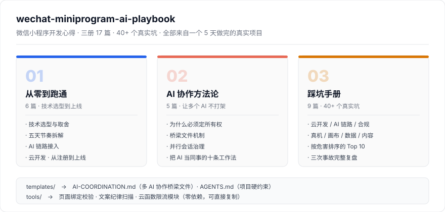
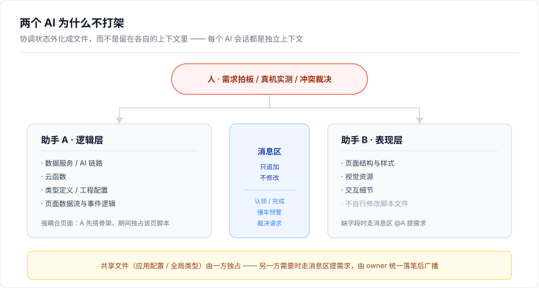

# 五天，用 AI 协作做完一个完整微信小程序

> 微信小程序开发心得 · 一个人 + 两个 AI 助手 + 5 个工作日
> 一份实战复盘。写的是**怎么做的、踩了哪些坑、怎么避免、以及我认为最优的工作方式**。
> 不是教程，没有"三步学会"；每一条结论都对应一次真实的失败。

---

## 这份复盘是怎么来的

2026 年 9 月，我在 5 个工作日内从零做完了一个可直接体验的微信小程序：原生 TypeScript + CloudBase 云开发 + 双 AI 链路（文本生成路线、图生图风格焕新），涵盖 5 个 Tab、14 个页面、3 个云函数、53 条自动化测试、202 条内容纪律扫描。

整个过程由**一个人 + 两个 AI 编码助手并行协作**完成。真正值得记录的不是产品本身，而是两件事：

1. **和 AI 协作做工程时，最大的成本不是"AI 写不出代码"，而是"两个 AI 互相覆盖对方的代码"**；
2. **AI 是概率系统**——会超时、会限流、会被截断、会"看起来很对但完全不能用"。围绕它做的所有设计都必须假设它会失败。

这个仓库把这两件事拆开讲透了。

---

## 三册结构

| 分册 | 目录 | 讲什么 | 谁该读 |
|---|---|---|---|
| **第一册 · 从零到跑通** | [`guide/`](guide/) | 技术选型取舍、5 天节奏拆解、AI 链路接入细节、云开发与部署、**提示词设计** | 想用同一条路做完一个作品的人 |
| **第二册 · AI 协作方法论** | [`ai-collaboration/`](ai-collaboration/) | 文件所有权制、桥梁文件、并行会话治理、把 AI 当同事的工作法 | **和 AI 长期协作开发的人**（本仓库最有原创性的部分） |
| **第三册 · 踩坑手册** | [`pitfalls/`](pitfalls/) | 按主题收录 40+ 个真实坑与修法：云开发、权限合规、真机调试、画布图像、数据状态、内容质量、工具链、事故复盘 | 正在踩或即将踩的人 |

第二册的核心机制长这样 —— 它解决的是"两个 AI 各自都觉得自己做对了，但合起来是错的"：

配套的**通用骨架**（可直接复制到自己项目）：

| 资产 | 位置 | 作用 |
|---|---|---|
| 桥梁文件模板 | [`templates/AI-COORDINATION.md`](templates/AI-COORDINATION.md) | 双 AI / 多 AI 协作的所有权表与消息区 |
| 项目约定模板 | [`templates/AGENTS.md`](templates/AGENTS.md) | 给 AI 的项目上下文与硬约束，开工前必读 |
| 页面绑定校验器 | [`tools/verify-miniprogram.cjs`](tools/verify-miniprogram.cjs) | 事件绑定 ↔ 处理器 ↔ 页面注册 三方一致性 |
| 内容纪律扫描器 | [`tools/check-copy-discipline.cjs`](tools/check-copy-discipline.cjs) | 逐条打印"哪条文案不合格"，不中断 |
| 云函数限流模块 | [`tools/cloudfunction-ratelimit.js`](tools/cloudfunction-ratelimit.js) | 内存滑动窗口限流，零 DB 成本挡脚本刷 |

> 三个工具都是**零依赖 Node 脚本**，改个配置路径就能跑。限流模块的设计取舍（为什么用内存不用数据库、参数为什么按危害定而非按成本定）写在文件头注释里。

---

## 先给结论：六条我认为最值钱的判断

**1. 给 AI 划所有权，比给 AI 写 prompt 更重要。**
两个 AI 同时在线时，最贵的错误不是"写错了"，而是"写对了又被另一个改回去"。更隐蔽的是**重复实现**——两份功能相同的代码各自都正常工作，只有"改了 A 那份 B 那份没变"时才暴露。我们用一张**文件所有权表**（逻辑归 A、皮肉归 B）+ 一个 **append-only 消息区**解决，全程零冲突。

**2. 兜底比聪明更重要。**
AI 会失败是事实，不是意外。产品必须在 AI 完全不可用时**依然是一条完整可用的路径**——降级模板、按需补全、失败回原图。**"AI 挂了也能用"本身就是一条产品能力**，不是技术补丁。

**3. 给动作，不给形容词。**
"注意三分法构图"是形容词，用户读完还是不会做；"从北门进来第一个花坛右侧，手机横举齐眼，让牌坊在画面上方 1/3 处"才是动作。**这条纪律被写进了自动化校验脚本**，出现术语直接判不合格。

**4. 能枚举的，就不要让模型自由发挥。**
让模型写自然语言、再用关键词去反推它说的是什么 —— 结果一定是**所有条目都落到默认值**，因为你的关键词永远覆盖不全。有限取值就写成枚举，关键词只留作兜底。

**5. 测试不只是防回归，它是设计工具。**
有一个"新用户档案带着旧积分"的 bug，是**写单元测试时被测试本身抓出来的**——因为它逼我问"这个默认值能不能被就地修改"。一个纯函数被提取出来测试的过程，本身就是一次设计审查。

**6. 提交给评审的工程包，本身就是一次安全审查。**
源码里硬编码的第三方服务 key、默认管理员口令、私钥文件——**代码一旦交付就等于公开**。这次在提交前删掉了一处源码兜底的 key，那是整轮审核里危害最高的一项。

---

## 数据锚点

写复盘最容易变成感觉文学，所以先把数字钉住：

| 维度 | 数字 |
|---|---|
| 开发周期 | 5 个工作日（09-07 → 09-11 主体完成，09-13 ~ 09-17 打磨） |
| 工程规模 | 51 次提交 · 83 个源文件 · 18,332 行（不含配置与素材） |
| 页面结构 | 5 个 Tab × 14 个页面 |
| 云服务 | 3 个云函数 · 4 个数据库集合 |
| 内容资产 | 80 个真实机位（10 城 × 8）· 24 套兜底模板 · 43 枚奖章 |
| 质量保障 | 53 条自动化测试 · 2 个静态校验工具 · 202 条文案扫描 |
| 协作方 | 1 人 + 2 个 AI 助手并行 |

**一次全项目深审的结果**：四路并行审查后，剔除 3 项误报、确认并修复 **9 项真实缺陷**。其中 3 项是"平时跑得通、特定路径必崩"的类型（已打卡时换照片静默丢失、从历史继续会清空进行中进度、云端抖动时后台入口对所有用户外露）。

> **剔除误报这一条同样重要。** 自动化审查会报出"看起来像 bug 的刻意设计"——比如"解析出少量条目就整体降级"其实是刻意的策略（残缺内容比模板内容体验更差）。**凡是刻意的设计，必须在代码里写清原因**，否则它一定会在下一次审查中被"修好"。

---

## 怎么用这个仓库

**如果你是第一次做小程序：**
从 [`guide/01-技术选型.md`](guide/01-技术选型.md) 开始，按顺序读完第一册，再挑第三册里与你技术栈相关的章节。

**如果你已经在和 AI 协作写代码，并且感觉效率没提上去：**
直接读 [`ai-collaboration/`](ai-collaboration/)。这一册不讲技术，讲的是**流程制度**。哪怕你只有一个 AI 助手，其中的"所有权制"和"收工必汇报"也立刻可用。

**如果你正在被某个具体的坑卡住：**
直接看 [`pitfalls/README.md`](pitfalls/README.md) 的索引，40+ 条按主题归类，每条都是「现象 → 根因 → 修法 → 教训」四段式。时间紧就先看**按危害排序的 Top 10**。

**如果你要接 AI 生成结构化内容：**
读 [`guide/05-提示词设计.md`](guide/05-提示词设计.md)，里面有一份可直接改造的完整提示词骨架，以及七个会让输出"看起来对但用不了"的反面模式。

**如果你只想抄一个东西：**
抄 [`templates/AI-COORDINATION.md`](templates/AI-COORDINATION.md)，放进你的项目根目录，然后按里面的模板开始记录。成本 5 分钟，收益在你第二次让 AI 改同一个文件时兑现。

---

## 关于来源、边界与诚实性

- 本仓库**不包含**该小程序的业务源码、内容数据、设计稿与界面截图。涉及具体业务的部分只作为**背景说明**出现；方法论与工具链部分是通用的，可自由用于任何项目。
- 文中所有数字、失败次数、修复项数均来自实际工作记录与代码统计，**未做估算或美化**。
- **凡是我判断不成立、或后来被自己推翻的结论，都保留了纠错痕迹**——见第三册的「事故复盘」与各篇末尾的"一度判断错的地方"。一处平台能力、一处隐私声明、一处合规策略、一处分享功能范围，都是先判错后更正的。保留它们不是自曝其短，是因为**一份从不犯错的记录读起来像宣传材料**。
- 涉及第三方服务的地方只提**服务类型与官方文档方向**，不含任何密钥、AppID、环境 ID、账号信息。
- 隐私相关的个人标识、内部口令、本机绝对路径已全部移除。

## 关于作者

一个人，两个 AI 助手，五天。仓库同时发布在 GitHub 与 CNB。

如果这份复盘帮你省下了一个下午，那它就算没白写。发现内容有误欢迎直接开 Issue —— 尤其是**平台规则类的内容**，这类信息变化快，我踩过的坑不一定还是坑。

---

## 许可

[MIT](LICENSE)。工具与模板可自由用于商业项目，无需署名。
